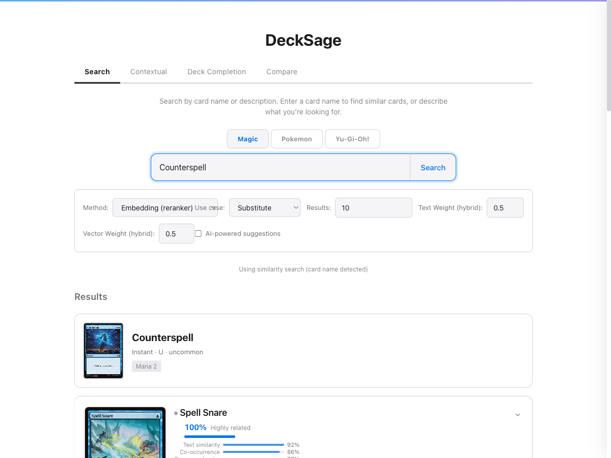
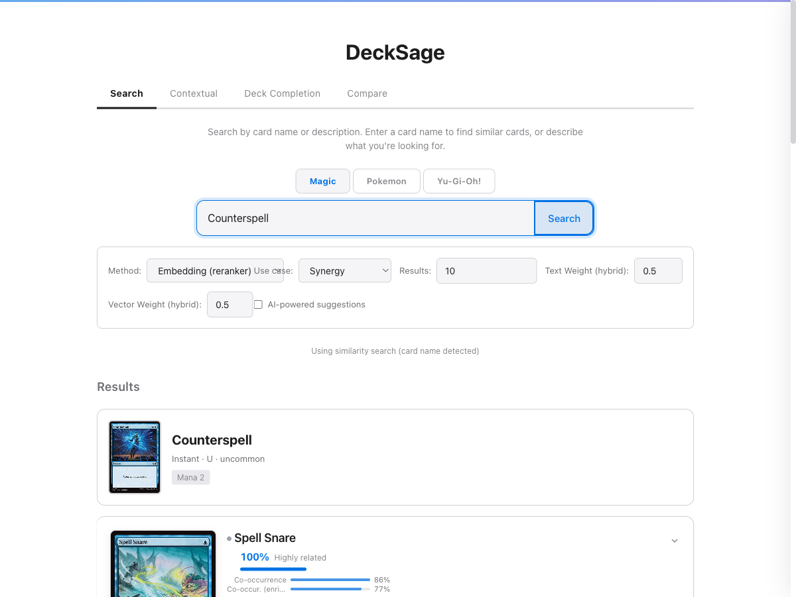
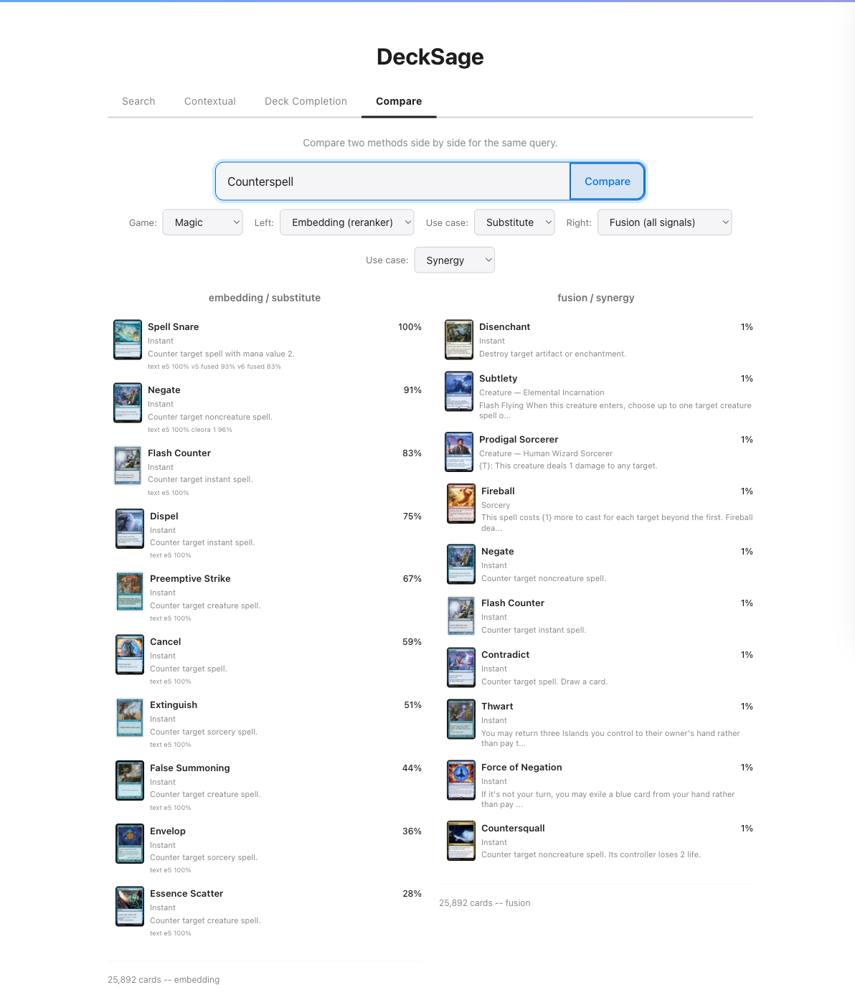
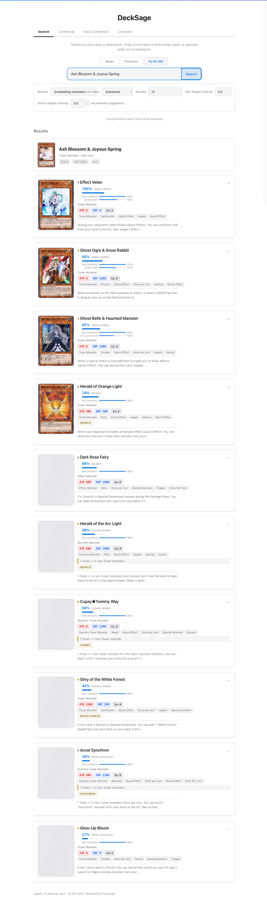
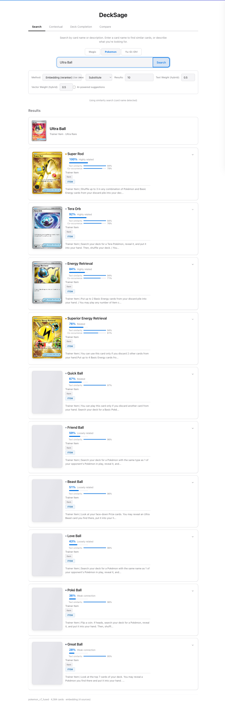
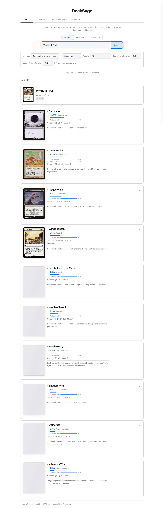
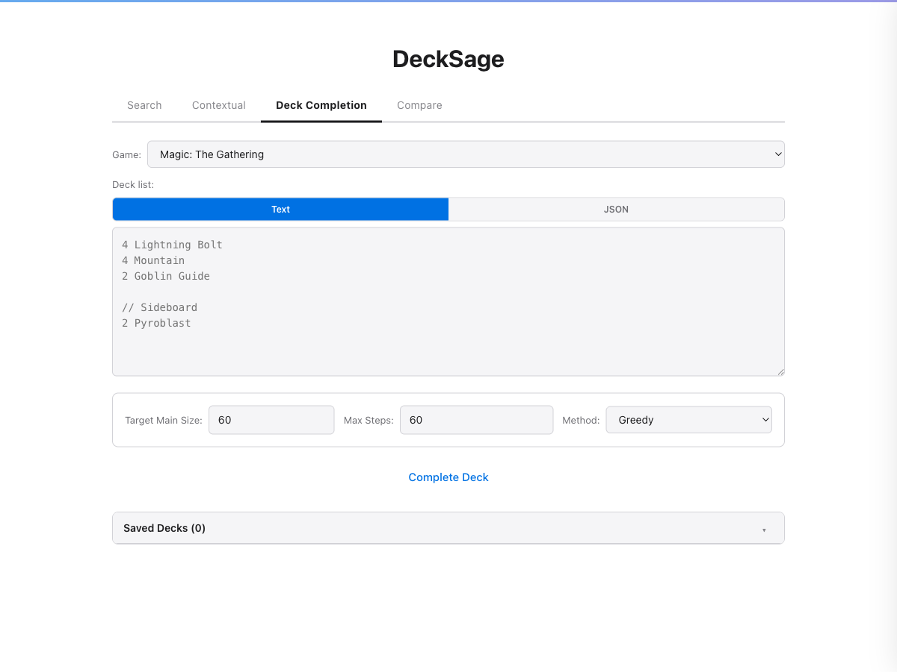

# DeckSage Demo Script

Setup: ~10 min. Demo: ~30 min.

---

## Pre-demo prep

### Setup on demo machine

```bash
git clone https://github.com/arclabs561/decksage.git && cd decksage
uv sync --extra embeddings
curl -Lo /tmp/decksage-demo-data.tar.gz "<PRESIGNED_URL>"
tar xzf /tmp/decksage-demo-data.tar.gz
cp .env.example .env
docker compose up -d meilisearch qdrant
uv run uvicorn src.ml.api.api:app --host 127.0.0.1 --port 8001
```

Verify: `curl http://localhost:8001/live` returns `{"status":"live"}`.

### Screenshots (pre-captured, use as backup if setup fails)

All in `docs/figures/`:

1. **Counterspell substitute** (`demo_counterspell_substitute.png`): all counterspells, score breakdown bars visible
   

2. **Counterspell synergy** (`demo_counterspell_synergy.png`): Day's Undoing, Narset, Jace -- blue control staples, not counterspells
   

3. **Compare tab** (`demo_compare_sub_vs_syn.png`): side-by-side, same card, different results. This is the money shot.
   

4. **YuGiOh hand traps** (`demo_yugioh_ash_blossom.png`): Ash Blossom -> Effect Veiler, Ghost Ogre, Ghost Belle. Cross-game proof.
   

5. **Experiment progression** (`experiment_progression.png`): nDCG across 63 experiments (already exists)

### Pre-tested queries with known-good results

Verified responses (use_case parameter, not method):

```
Counterspell substitute -> Spell Snare, Negate, Flash Counter, Dispel, Preemptive Strike
Counterspell synergy    -> Spell Snare, Day's Undoing, Narset, Mystic Gate, Jace
Sol Ring substitute     -> Rakdos Signet, Azorius Signet, Hedron Archive, Dimir Signet
Sol Ring synergy        -> Cultivate, Lightning Greaves, Temple of the False God, Reliquary Tower
Wrath of God substitute -> Damnation, Catastrophe, Plague Wind, Winds of Rath
Lightning Bolt substitute -> Wizard's Lightning, Lightning Strike, Lightning Blast, Lightning Helix
Ash Blossom (YGO)      -> Effect Veiler, Ghost Ogre, Ghost Belle, Herald of Orange Light
Ultra Ball (PKM)        -> Super Rod, Tera Orb, Energy Retrieval, Quick Ball
```

Response times: substitute/synergy ~70ms, fusion ~4.5s (computes all 6 signals live).

---

## 1. Problem + Analogy (2 min, talk)

Start with the analogy, not the jargon:

> "When you buy a phone on Amazon, it recommends phone cases -- things that **go with** your purchase. That's a complement. But what if you want to find **other phones like yours**? That's a substitute. Very different problem, and the data you'd use (purchase history) is better at complements."

Then ground it:

> "Same problem in trading card games. 184K tournament deck lists tell us which cards appear together -- that's complement. But players also want: 'my card got banned, what replaces it?' or 'this card costs $50, what's the budget version?'  That's substitute -- and co-occurrence data is bad at it."

Three games: Magic (26K cards), Pokemon (4.4K), Yu-Gi-Oh (13K). All with different game mechanics, card text formats, and metagames.

---

## 2. Live demo: substitute vs synergy (7 min, show)

Open `http://localhost:8001`. This is the core demo moment. The whole point is showing that the same card returns completely different results depending on the question.

### Star demo: Counterspell

This is the clearest example. Do this one first.

**Substitute** (mode dropdown -> substitute): search "Counterspell"
> Results: Spell Snare, Negate, Flash Counter, Dispel, Preemptive Strike
> "These are all counterspells. Different costs, different restrictions, but they all do the same thing: stop your opponent's spell."

**Synergy** (switch to synergy): same card
> Results: Swords to Plowshares, Disenchant, Dark Ritual, Brainstorm, Mishra's Factory
> "Completely different cards. These are what you'd PUT IN THE SAME DECK as Counterspell -- removal, card draw, mana. They complement it, they don't replace it."

Point out: the results share ZERO cards between modes. This is the complement-vs-substitute distinction made visible.

### Second demo: Sol Ring

**Substitute**: Rakdos Signet, Azorius Signet, Hedron Archive, Dimir Signet, Orzhov Signet
> "All mana rocks. Sol Ring makes mana; so do these."

**Synergy**: Cultivate, Lightning Greaves, Temple of the False God, Reliquary Tower, Chaos Warp
> "Commander staples. Cards you play alongside Sol Ring in the same deck."

### Compare tab

Switch to the Compare tab. Enter "Lightning Bolt". Left=substitute, right=synergy. Both panels render simultaneously with the same card, different results. Point at the difference.

### Cross-game (quick, 1 min -- show all 3 games work)

- Switch game to **Yu-Gi-Oh**, search "Ash Blossom & Joyous Spring", mode=substitute
  > Effect Veiler, Ghost Ogre, Ghost Belle -- all hand traps. Different game, same principle.
  

- Switch to **Pokemon**, "Ultra Ball", substitute
  > Super Rod, Tera Orb, Quick Ball, Friend Ball, Beast Ball, Poke Ball, Great Ball -- all search/retrieval Trainer Items.
  

### What to point out in the UI

- **Score breakdown bars** on each result: 6 colored segments showing which signals contributed (embed, jaccard, functional, text, visual, archetype)
- **Response time** in bottom-left: ~70ms for substitute/synergy
- **Card images** and metadata: loaded live from Scryfall/official APIs
- **Typeahead**: start typing and watch MeiliSearch autocomplete

---

## 3. Why is this hard? (5 min, talk + show figure)

Show `docs/figures/experiment_progression.png`. This is the nDCG curve across 63 experiments.

### 5-beat story (point at the chart as you go):

**Beat 1 -- Baseline is bad for the wrong reason.**
Co-occurrence embeddings (Word2Vec on deck lists) get functional AUC 0.317 for substitution. Barely above random. They're good at "what goes together" but bad at "what does the same thing."

**Beat 2 -- GNNs can't fix a data problem.**
We tried LightGCN and Heterogeneous Graph Transformers. Link prediction AUC 0.80 -- the model learned the graph. But similarity nDCG: 0.003. The objective function (reconstruct edges) doesn't produce similarity-preserving embeddings. Architecture doesn't matter when the loss function is wrong.

> "This killed two months of GNN experiments. The lesson: if your training signal measures X, your embeddings will be good at X, not at Y."

**Beat 3 -- Evaluation is harder than training.**
We discovered our annotations had 43-76% duplicates from multi-model judging. All nDCG numbers for a week were inflated 50-101%. After fixing that, we found that annotating what the model actually retrieves (top-K hole filling) had 5-10x the impact of annotating random pairs. nDCG jumped from 0.10 to 0.52.

> "We spent more engineering time on evaluation methodology than on model architecture. That's the right allocation."

**Beat 4 -- Text wins.**
After 60 experiments of co-occurrence engineering, we tried E5-base-v2 text similarity. Zero-shot, no training. It beat everything by 14-25% at substitute. Co-occurrence captures what goes together; text captures what does the same thing.

| Game | Co-occurrence nDCG | Text nDCG | Gap |
|------|--------------------|-----------|-----|
| Magic | 0.503 | 0.613 | +22% |
| Pokemon | 0.414 | 0.518 | +25% |
| Yu-Gi-Oh | 0.465 | 0.532 | +14% |

> "The irony: the best substitute signal required zero training. But you can't know that without the evaluation infrastructure to measure it."

**Beat 5 -- Honest numbers are always lower.**
Cross-encoder reranker: v2 reported Pearson 0.695. v3 with proper query-level train/val split: 0.56. The difference? Same query card in both train and val = data leakage.

### Failures table (optional, show if audience is ML-oriented):

| Attempt | Result | Lesson |
|---------|--------|--------|
| LightGCN (exp 0004) | Sweep eval 0.545, real eval 0.095 | Never trust sweep-internal eval |
| 10x Pokemon data (exp 0003) | nDCG barely moved | Tournament decks are homogeneous |
| Deployed v7 (exp 0053) | Was 4-sigma outlier above mean | Multi-seed validation is mandatory |
| E5 fine-tuning (exp 0064) | Catastrophic forgetting (0.44->0.29) | Frozen encoder + fusion > fine-tuning |
| 51K Commander decks (exp 0050) | No improvement | Commander format != cross-format substitute |

---

## 4. How it works: 6 signals (3 min, show breakdown bars)

Go back to the UI. Search "Wrath of God", mode=**Embedding (reranker)**, use_case=**Substitute**.

Point at the breakdown bars on each result. Damnation shows text_e5=97%, co-occurrence varies per card. The bars make the signal architecture visible.



Six signals, fused via Reciprocal Rank Fusion:

1. **Embedding cosine** -- co-occurrence signal (complement)
2. **Jaccard** -- direct deck overlap (complement)
3. **Functional tags** -- type, keywords, mana cost (rules-based, no learning)
4. **Text E5** -- card text similarity (best at substitute)
5. **Visual SigLIP2** -- card art similarity
6. **Archetype** -- deck archetype template matching

> "For substitute queries, the reranker upweights text_e5 and dampens co-occurrence. For synergy queries, it does the opposite. Same data, different routing."

Latency note: fusion takes ~4.5s because it computes all 6 signals live. Substitute/synergy route to a single signal: ~70ms.

---

## 5. Annotation pipeline (5 min, talk + show prompt)

> "How do you evaluate card similarity at scale? You can't hire Magic experts for 100K annotations. We used LLMs."

### Show the prompt

Open `scripts/annotation/multi_model_annotate.py` in an editor (line 101). The actual prompt sent to Groq/Cerebras:

```
Rate these MAGIC cards on similarity (0.0-1.0).

Card A: Lightning Bolt | Instant | {R} | Lightning Bolt deals 3 damage to any target.
Card B: Shock | Instant | {R} | Shock deals 2 damage to any target.

SCORING SCALE (use the FULL range):
- 0.00: Unrelated. Different functions, different archetypes.
- 0.15: Tangential. Same broad category but different targets/timing/cost.
- 0.40: Moderate. Same function AND similar cost, or strong co-occurrence.
- 0.65: Strong similarity. Competitive alternatives, similar efficiency.
- 0.80: Near-substitute. Functionally interchangeable, minor differences.
- 1.00: Functional reprint or strictly-better/worse pair.

CALIBRATION ANCHORS:
- Lightning Bolt vs Shock = 0.70 (same function, different damage)
- Path to Exile vs Swords to Plowshares = 0.80 (near-identical effect)
- Counterspell vs Mana Leak = 0.50 (same function, different late-game)
- Lightning Bolt vs Counterspell = 0.10 (both instants, different functions)
- Sol Ring vs Wrath of God = 0.05 (unrelated)
```

### Three things that matter in the prompt:

1. **Card context is mandatory.** Without oracle text, LLMs hallucinate card effects from names. "Sacred Ground" gets matched to "Wrath of God" because "ground" appears in board-wipe contexts. Error rate: 16% without context, 1% with.

2. **Calibration anchors.** Without them, models cluster everything around 0.5. The anchors spread the distribution across the full 0-1 range.

3. **Multi-model cascade.** Groq Llama 70B + Cerebras Llama 235B. Two independent models, consensus-averaged. Cost: $0.40 per 1000 pairs.

### The eval-annotation loop (show as diagram or describe):

```
Train embedding -> Retrieve top-K for each test query -> Find unjudged results
    -> Annotate those specific holes -> Recompute nDCG -> Repeat
```

> "Annotating the candidates the model actually retrieves had 5-10x the impact of annotating random pairs. Two rounds of hole-filling, $23 total, moved nDCG from 0.10 to 0.52. Total annotation cost: ~$25 for 100K pairs across 3 games."

### What went wrong:

- Multi-model IAA produced duplicate annotations per pair. All nDCG inflated 50-101% for a week before we caught it.
- 8B models (Ollama llama3.2) are useless: 54% zero scores, correlation -0.076 vs human agreement. Minimum viable: 70B.
- Inter-judge agreement (Krippendorff alpha): 0.43. Models disagree on fine-grained scores. We accept that and consensus-average.

---

## 6. Deck completion (3 min, show)

In the Swagger UI (`http://localhost:8001/docs`), find POST `/v1/deck/complete`.

Paste this payload:

```json
{
  "game": "magic",
  "deck": {
    "Main": [
      "Lightning Bolt", "Lightning Bolt", "Lightning Bolt", "Lightning Bolt",
      "Monastery Swiftspear", "Monastery Swiftspear", "Monastery Swiftspear", "Monastery Swiftspear",
      "Goblin Guide", "Goblin Guide", "Goblin Guide", "Goblin Guide",
      "Eidolon of the Great Revel", "Eidolon of the Great Revel", "Eidolon of the Great Revel", "Eidolon of the Great Revel"
    ]
  },
  "target_main_size": 30,
  "method": "greedy"
}
```

Three completion methods (selectable in the UI Method dropdown):

- **Greedy**: picks the highest-scoring candidate one at a time. Fast, simple, myopic.
- **Beam search** (beam_width=3): maintains 3 partial decks in parallel, picks the best complete deck. Can follow archetype curve targets (25 Magic archetypes, 15 YGO, 10 Pokemon).
- **OT (Optimal Transport)**: formulates completion as a Sinkhorn transport problem. Source = quality-weighted candidate pool, target = archetype mana curve distribution, cost matrix = embedding distance + role gaps. Uses ILP rounding for integer card counts. Most principled but slowest. Requires `pot` package.

The system also auto-detects the deck's archetype from seed cards and adjusts curve targets.



---

## 7. Takeaways (2 min, talk)

Three things:

1. **The training signal defines the ceiling.** Co-occurrence data is fundamentally a complement signal. No architecture (GNN, Word2Vec, contrastive) overcomes that. For substitute, you need text or function-level matching. Match your signal to your task.

2. **Evaluation infrastructure is the bottleneck.** We ran 63 experiments. The biggest jumps came from fixing evaluation methodology (dedup, hole-filling, condensed nDCG), not from better models. Measuring correctly is harder and more impactful than training better.

3. **LLM annotations at scale are viable and cheap.** 100K calibrated annotations for $25 using open-weight models via inference APIs. The key: calibration anchors in the prompt, card context in every query, minimum 70B model size, multi-model consensus.

> "Why not just ask ChatGPT to recommend cards? Latency (70ms vs 3-5s), cost ($0 per query vs ~$0.01), determinism (same query = same results), transparency (you can see which of 6 signals drove the ranking), and coverage (all 43K cards pre-indexed, no hallucinated card names)."

---

## Backup material (for Q&A, don't present unless asked)

### Scraping architecture (limpet)

The Go backend (`src/backend/`) scrapes 6 game sources (MTGGoldfish, MTGTop8, Archidekt, Limitless TCG, MasterDuelMeta, YGOProDeck). Key design:

- **limpet** (our own Go library): HTTP cache that stores raw responses (HTML/JSON) in a local blob store. "Scrape once, store forever." Parsing logic runs against the cache, so when extraction code changes, we re-parse without re-fetching.
- **Residential proxy rotation** for Cloudflare-protected sites (MasterDuelMeta, some Archidekt endpoints). TLS fingerprint spoofing to avoid bot detection.
- Motivation: residential proxy bandwidth is the expensive resource. By caching raw responses, we decouple the cost of acquiring data from the cost of iterating on parsing/extraction logic. Parse bugs get fixed without burning proxy credits.
- Result: 184K deck lists (Magic 83K, Pokemon 24K, YuGiOh 77K) stored as JSONL, re-parseable at will.

### Annotation quality: IAA and Dawid-Skene

5 LLM judges annotated ~2,300 unique pairs (Magic) with continuous similarity scores:

| Model | Dawid-Skene Accuracy |
|-------|---------------------|
| Claude Haiku 4.5 | 0.643 |
| Qwen 3.5 397B | 0.502 |
| Gemini 2.5 Flash Lite | 0.501 |
| DeepSeek Chat v3 | 0.436 |
| GPT-4.1 Nano | 0.397 |

Dawid-Skene (latent truth + annotator reliability model) produces consensus labels that weight more-reliable judges higher. Used for quality analysis but not for production eval -- production eval uses the multi-model cascade (Groq 70B + Cerebras 235B) which is cheaper and produces calibrated continuous scores.

The Krippendorff alpha of 0.43 means models agree on broad strokes (similar vs dissimilar) but disagree on fine-grained distinctions. This is expected -- even human experts disagree on "is Counterspell vs Mana Leak a 0.50 or a 0.60?"

### Saturation methodology (fill-the-holes)

The standard vs condensed nDCG gap measures annotation coverage:

```
Standard nDCG: treats unjudged cards as irrelevant (score=0)
Condensed nDCG: only ranks cards that have been annotated

Gap = condensed - standard
  Large gap -> many unjudged cards in top-K, metric measures coverage not quality
  Small gap -> top-K is fully judged, metric reflects true ranking quality
```

The fill-the-holes loop:
1. Run eval, note the gap
2. For each query, find top-K results that have no annotation
3. Send those specific (query, candidate) pairs to the annotation cascade
4. Re-run eval

Impact per round:
- Round 1 (5K holes): Magic nDCG 0.104 -> 0.233, gap dropped from 0.45 to 0.22
- Round 2 (remaining holes): Magic nDCG 0.233 -> 0.525, gap dropped to 0.002 [SATURATED]
- Each round cost ~$6-12 in API calls

Saturation is embedding-specific: training a new embedding reshuffles top-K and creates new holes.

### Real annotation examples (for Clone)

Clone has 46 annotations in the test set. Top matches:

| Candidate | Similarity | Explanation |
|-----------|-----------|-------------|
| Clever Impersonator | 1.00 | Copy any permanent -- strict upgrade |
| Progenitor Mimic | 1.00 | Clone + token generation each turn |
| Cryptoplasm | 1.00 | Re-cloneable creature |
| Body Double | 0.80 | Clone from graveyard (subset of function) |
| Stunt Double | 0.80 | Clone with flash |
| Bountiful Harvest | 0.06 | Unrelated (life gain spell) |
| Savannah | 0.06 | Unrelated (dual land) |

These annotations show calibrated scoring: functional reprints get 1.0, partial overlaps get 0.80, unrelated cards get 0.05-0.06.

### Optimal Transport deck completion -- how it works

The OT completer (`src/ml/deck_building/ot_completion.py`) frames "fill the remaining deck slots" as a transport problem:

- **Source distribution**: candidate card pool, weighted by affinity to the seed deck (high affinity = more mass). Not uniform -- good candidates get more budget.
- **Target distribution**: the archetype's ideal mana curve (e.g., burn wants 20 one-drops, 12 two-drops, 4 three-drops). 25 Magic archetypes, 15 YGO, 10 Pokemon.
- **Cost matrix C[i,j]**: blends embedding distance between pool cards (structural diversity -- don't pick 10 copies of the same effect) with each card's affinity to the seed (quality). This avoids the circular problem where both source and target come from the same embedding.
- **Solver**: log-stabilized Sinkhorn (`pot.sinkhorn` with `method='sinkhorn_log'`) at low regularization (reg=0.01). Produces fractional transport plan.
- **Rounding**: ILP via `scipy.optimize.milp` to get integer card counts from the fractional plan, respecting copy limits (4 in Magic, 3 in Pokemon) and deck-size target. Falls back to greedy rounding if scipy unavailable.
- **Unbalanced OT** (optional): KL penalty lets the solver leave weak candidate slots empty rather than filling them with bad cards.

Why OT instead of greedy? Greedy picks the best card at each step, ignoring downstream interactions. OT optimizes the entire deck simultaneously -- if slot 5 needs a 2-drop and slot 6 needs removal, OT can choose a card that does both, while greedy would pick the best 2-drop and the best removal separately.

### E5 text embeddings -- role in the system

E5-base-v2 (`intfloat/e5-base-v2`) is loaded at API startup and serves multiple roles:

1. **Text similarity signal** (`text_e5` in the reranker): the strongest substitute signal, 14-25% better than co-occurrence at finding functional replacements.
2. **Precomputed index** (`data/cache/text_embeddings/`): all card oracle texts pre-embedded for fast cosine lookup. Used by fusion mode for candidate generation.
3. **Substitute mode text-boost**: the reranker weights `text_e5 >= 0.5` and dampens co-occurrence by 70% specifically for substitute use_case queries.
4. **Visible in the UI**: the "Text similarity" bar in score breakdowns (blue bars showing 92-97% for good substitutes).

We also tried fine-tuning E5 on our annotation data (exp 0005 multi-task, exp 0064 bi-encoder). Both suffered catastrophic forgetting -- the fine-tuned model lost its general text understanding. Frozen E5 as one signal in the fusion ensemble is more robust than a fine-tuned E5 as the only signal.

### Key decision provenance (why we chose what we chose)

| Decision | When | Why | Evidence |
|----------|------|-----|----------|
| PecanPy + Word2Vec (not GNN) | exp 0004, 0054-0055 | GNNs optimize edge reconstruction, not similarity | LightGCN nDCG 0.095, HGT 0.003 |
| ns_exponent=-0.5 | exp 0002 | Down-weights staple cards in negative sampling (Caselles-Dupre 2018) | Functional AUC improved |
| Card attribute fusion alpha=0.7 | exp 0002 | PCA-projected card attributes blended with embeddings | Without it, nDCG drops 30-50% |
| Spectral propagation | exp 0056 | Smooths embeddings over graph Laplacian | +0.004 nDCG, stabilizes training variance |
| Text-boosted substitute mode | exp 0061-0062 | Text captures "same function", co-occurrence captures "same deck" | Text_e5 wins by 14-25% on substitute nDCG |
| Frozen E5 (not fine-tuned) | exp 0005, 0064 | Fine-tuning catastrophically forgets general text understanding | Pearson dropped 0.44->0.29 |
| Multi-model cascade (not single LLM) | exp 0057 | Single 8B model: 54% zeros, corr -0.076. Two 70B+ models, averaged | Cost: $0.40/1K pairs vs $2-15 for frontier |
| Condensed nDCG (not standard) | exp 0058-0059 | Standard nDCG penalizes unjudged cards as irrelevant | Gap closed from 0.45 to 0.002 after hole-filling |
| Greedy hole-filling (not random annotation) | exp 0058-0059 | Annotating what the model retrieves has 5-10x impact | nDCG 0.10->0.52 in two rounds ($23) |
| Limpet cache-first scraping | initial design | Residential proxy is the expensive resource | Parse bugs fixed without re-scraping |
| Per-game models (not unified) | initial design | Game mechanics differ too much (mana vs energy vs levels) | Per-game nDCG always beats unified |

### "What about new cards with no deck history?"

Three of six signals work without co-occurrence data: text embeddings, functional tags, and visual embeddings. New cards get text+functional+visual similarity immediately. Co-occurrence and Jaccard signals fill in as tournament data accumulates.

### "Why Word2Vec and not something more modern?"

PecanPy (node2vec variant) on the co-occurrence graph feeds into Word2Vec. It's the right tool for this: graph-walk embeddings on a co-occurrence matrix. We tried GNNs (LightGCN, HGT) and they performed worse because the objective function matters more than the architecture.

### "Why condensed nDCG?"

Standard nDCG penalizes unjudged cards as irrelevant. With sparse annotations (~100K across 43K cards), most top-K results are unjudged. Condensed nDCG (Sakai 2007) only ranks judged items, measuring ranking quality not annotation coverage. When the gap between standard and condensed nDCG closes (<0.005), annotations are saturated for that embedding.

### "Is this production-ready?"

It runs on CPU, no GPU needed for serving. MeiliSearch + Qdrant in Docker for search. ~40s cold start to load 3 games. Response time: 70ms for single-signal modes, ~4.5s for fusion (all 6 signals). 818 unit tests, 45 E2E tests. Deployed locally -- no public instance yet.

### Architecture (show if asked)

```
Frontend (vanilla HTML/JS, no framework)
    |
FastAPI (src/ml/api/api.py, ~2200 LOC)
    |
    +-- Qdrant (vector search, auto-indexed at startup)
    +-- MeiliSearch (text search + typeahead)
    +-- WeightedLateFusion (6 signals, RRF aggregation)
    +-- Reranker (multi-source, use_case-aware weighting)
    +-- DeckBuilder (greedy, beam search, optimal transport)
    |
Data layer:
    +-- Embedding files (.wv, PecanPy Word2Vec)
    +-- Unified SQLite graph (card metadata, co-occurrence, edge types)
    +-- Text embedding index (E5-base-v2, precomputed)
    +-- Visual embedding index (SigLIP2, precomputed)
    +-- Archetype templates (25 Magic, 15 YGO, 10 Pokemon)
```

### Data sources

| Source | Game | Decks | Format |
|--------|------|-------|--------|
| MTGGoldfish | Magic | 18K | Modern, Standard, Pioneer |
| MTGTop8 | Magic | 14K | Legacy, Vintage, Modern |
| Archidekt | Magic | 51K | Commander |
| Limitless TCG | Pokemon | 24K | Standard |
| MasterDuelMeta | Yu-Gi-Oh | 65K | Master Duel |
| YGOProDeck | Yu-Gi-Oh | 12K | Tournament |

### Full experiment index

See `data/experiments/SUMMARY.md` (63 experiments) and `docs/experimental_narrative.md` (12-phase walkthrough with failure analysis).
