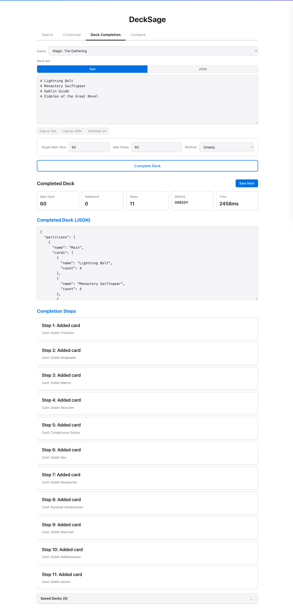

# DeckSage Demo Script

Setup: ~10 min. Demo: ~30 min.

---

## Pre-demo prep

### Setup on demo machine

Prerequisites: Python 3.11+, [uv](https://github.com/astral-sh/uv), Docker, ~8 GB disk.

```bash
# 1. Clone and install Python deps (~2 min)
git clone https://github.com/arclabs561/decksage.git && cd decksage
uv sync --extra embeddings

# 2. Download data assets (~2 min on fast connection, 1.8 GB)
#    Get a presigned URL (valid 12 hours, email it to yourself).
#    The tarball contains embeddings, graph DBs, pairs CSVs, text index.
curl -Lo /tmp/decksage-demo-data.tar.gz "<PRESIGNED_URL>"

# 3. Extract into repo root (~1 min). Creates files under data/.
#    This preserves directory structure: data/embeddings/, data/graphs/,
#    data/processed/, data/cache/. The .env.example defaults point to these paths.
tar xzf /tmp/decksage-demo-data.tar.gz

# 4. Create .env from template (defaults work with extracted data)
cp .env.example .env

# 5. Start search backends (MeiliSearch for text/typeahead, Qdrant for vectors)
docker compose up -d meilisearch qdrant

# 6. Verify backends are healthy before starting API
curl -sf http://localhost:7700/health && echo "MeiliSearch OK"
curl -sf http://localhost:6333/health && echo "Qdrant OK"

# 7. Start the API (~40s startup: loads 3 games, indexes cards into MeiliSearch/Qdrant)
uv run uvicorn src.ml.api.api:app --host 127.0.0.1 --port 8001
```

Verify: `curl http://localhost:8001/live` returns `{"status":"live"}`.
Open `http://localhost:8001` in a browser -- you should see the DeckSage UI with Magic/Pokemon/Yu-Gi-Oh game selector.

**If something breaks:**
- `uv sync` fails: check Python version (`python3 --version` must be 3.11+)
- Docker health check fails: `docker compose logs meilisearch` / `docker compose logs qdrant`
- API won't start: check `.env` exists and `data/embeddings/*.wv` files are present
- "No module named gensim": re-run `uv sync --extra embeddings`

### Screenshots (pre-captured, use as backup if setup fails)

All in `docs/figures/`:

1. **Counterspell substitute** (`demo_counterspell_substitute.png`): all counterspells, score breakdown bars visible
   

2. **Counterspell synergy** (`demo_counterspell_synergy.png`): Day's Undoing, Narset, Jace -- blue control staples, not counterspells
   

3. **Compare tab** (`demo_compare_sub_vs_syn.png`): side-by-side, same card, different results. This is the money shot.
   

4. **YuGiOh hand traps** (`demo_yugioh_ash_blossom.png`): Ash Blossom -> Effect Veiler, Ghost Ogre, Ghost Belle. Cross-game proof.
   

5. **Wrath of God breakdown bars** (`demo_wrath_embedding_breakdown.png`): text_e5 at 97%, shows signal architecture
   

6. **Pokemon Ultra Ball** (`demo_pokemon_ultra_ball.png`): all Ball/search items. Third game.
   

7. **Deck completion result** (`demo_deck_completion_result.png`): 16-card seed -> 60-card deck in 11 steps
   

8. **Experiment progression** (`experiment_progression.png`): nDCG across 63 experiments (already exists)

### Pre-tested queries with known-good results

Verified responses (use_case parameter, not method):

```
Counterspell substitute -> Spell Snare, Negate, Flash Counter, Dispel, Preemptive Strike
Counterspell synergy    -> Spell Snare, Day's Undoing, Narset, Mystic Gate, Jace
Sol Ring substitute     -> Rakdos Signet, Azorius Signet, Hedron Archive, Dimir Signet
Sol Ring synergy        -> Cultivate, Lightning Greaves, Temple of the False God, Reliquary Tower
Wrath of God substitute -> Damnation, Catastrophe, Plague Wind, Winds of Rath
Lightning Bolt substitute -> Wizard's Lightning, Lightning Strike, Lightning Blast, Lightning Helix
Ash Blossom (YGO)      -> Effect Veiler, Ghost Ogre, Ghost Belle, Herald of Orange Light
Ultra Ball (PKM)        -> Super Rod, Tera Orb, Energy Retrieval, Quick Ball
```

Response times: substitute/synergy ~70ms, fusion ~4.5s (computes all 6 signals live).

---

## 1. Problem + Analogy (2 min, talk)

Start with the analogy, not the jargon:

> "When you buy a phone on Amazon, it recommends phone cases -- things that **go with** your purchase. That's a complement. But what if you want to find **other phones like yours**? That's a substitute. Very different problem, and the data you'd use (purchase history) is better at complements."

Then ground it:

> "Same problem in trading card games. 184K tournament deck lists tell us which cards appear together -- that's complement. But players also want: 'my card got banned, what replaces it?' or 'this card costs $50, what's the budget version?'  That's substitute -- and co-occurrence data is bad at it."

Three games: Magic (26K cards), Pokemon (4.4K), Yu-Gi-Oh (13K). All with different game mechanics, card text formats, and metagames.

---

## 2. Live demo: substitute vs synergy (7 min, show)

Open `http://localhost:8001`. This is the core demo moment. The whole point is showing that the same card returns completely different results depending on the question.

### Star demo: Counterspell

This is the clearest example. Do this one first.

**Substitute** (Use case dropdown -> Substitute): search "Counterspell"
> Results: Spell Snare, Negate, Flash Counter, Dispel, Preemptive Strike
> "These are all counterspells. Different costs, different restrictions, but they all do the same thing: stop your opponent's spell."

**Synergy** (switch to synergy): same card
> Results: Spell Snare (#1), then Day's Undoing, Narset, Mystic Gate, Hall of Storm Giants, Jace the Mind Sculptor, Isochron Scepter
> "From result #2 onward these are completely different cards -- card draw, control finishers, utility lands. Cards you'd PUT IN THE SAME DECK as Counterspell, not replacements for it."

Note: Spell Snare appears in both modes (#1 in each) because it's both a functional substitute (another counterspell) AND a frequent co-occurrence partner. That's the honest overlap. From #2 onward the lists diverge completely -- point this out: "One card overlaps, the rest are totally different."

### Second demo: Sol Ring

**Substitute**: Rakdos Signet, Azorius Signet, Hedron Archive, Dimir Signet, Orzhov Signet
> "All mana rocks. Sol Ring makes mana; so do these."

**Synergy**: Cultivate, Lightning Greaves, Temple of the False God, Reliquary Tower, Chaos Warp
> "Commander staples. Cards you play alongside Sol Ring in the same deck."

### Compare tab

Switch to the Compare tab. The query carries over from Search (or type "Counterspell"). Set Left: Embedding/Substitute, Right: Fusion/Synergy. Hit Compare. Both panels render simultaneously -- same card, completely different results.


### Cross-game (quick, 1 min -- show all 3 games work)

- Switch game to **Yu-Gi-Oh**, search "Ash Blossom & Joyous Spring", mode=substitute
  > Effect Veiler, Ghost Ogre, Ghost Belle -- all hand traps. Different game, same principle.
  

- Switch to **Pokemon**, "Ultra Ball", substitute
  > Super Rod, Tera Orb, Quick Ball, Friend Ball, Beast Ball, Poke Ball, Great Ball -- all search/retrieval Trainer Items.
  

### What to point out in the UI

- **Score breakdown bars** on each result: 6 colored segments showing which signals contributed (embed, jaccard, functional, text, visual, archetype)
- **Response time** in bottom-left: ~70ms for substitute/synergy
- **Card images** and metadata: loaded live from Scryfall/official APIs
- **Typeahead**: start typing and watch MeiliSearch autocomplete

---

## 3. Why is this hard? (5 min, talk + show figure)

Show `docs/figures/experiment_progression.png`. This is the nDCG curve across 63 experiments.

### 5-beat story (point at the chart as you go):

**Beat 1 -- Baseline is bad for the wrong reason.**
Co-occurrence embeddings (Word2Vec on deck lists) get functional AUC 0.317 for substitution. Barely above random. They're good at "what goes together" but bad at "what does the same thing."

**Beat 2 -- GNNs can't fix a data problem.**
We tried LightGCN and Heterogeneous Graph Transformers. Link prediction AUC 0.80 -- the model learned the graph. But similarity nDCG: 0.003. The objective function (reconstruct edges) doesn't produce similarity-preserving embeddings. Architecture doesn't matter when the loss function is wrong.

> "This killed two months of GNN experiments. The lesson: if your training signal measures X, your embeddings will be good at X, not at Y."

**Beat 3 -- Evaluation is harder than training.**
We discovered our annotations had 43-76% duplicates from multi-model judging. All nDCG numbers for a week were inflated 50-101%. After fixing that, we found that annotating what the model actually retrieves (top-K hole filling) had 5-10x the impact of annotating random pairs. nDCG jumped from 0.10 to 0.52.

> "We spent more engineering time on evaluation methodology than on model architecture. That's the right allocation."

**Beat 4 -- Text wins.**
After 60 experiments of co-occurrence engineering, we tried E5-base-v2 text similarity. Zero-shot, no training. It beat everything by 14-25% at substitute. Co-occurrence captures what goes together; text captures what does the same thing.

| Game | Co-occurrence nDCG | Text nDCG | Gap |
|------|--------------------|-----------|-----|
| Magic | 0.503 | 0.613 | +22% |
| Pokemon | 0.414 | 0.518 | +25% |
| Yu-Gi-Oh | 0.465 | 0.532 | +14% |

> "The irony: the best substitute signal required zero training. But you can't know that without the evaluation infrastructure to measure it."

**Beat 5 -- Honest numbers are always lower.**
Cross-encoder reranker: v2 reported Pearson 0.695. v3 with proper query-level train/val split: 0.56. The difference? Same query card in both train and val = data leakage.

### Failures table (optional, show if audience is ML-oriented):

| Attempt | Result | Lesson |
|---------|--------|--------|
| LightGCN (exp 0004) | Sweep eval 0.545, real eval 0.095 | Never trust sweep-internal eval |
| 10x Pokemon data (exp 0003) | nDCG barely moved | Tournament decks are homogeneous |
| Deployed v7 (exp 0053) | Was 4-sigma outlier above mean | Multi-seed validation is mandatory |
| E5 fine-tuning (exp 0064) | Catastrophic forgetting (0.44->0.29) | Frozen encoder + fusion > fine-tuning |
| 51K Commander decks (exp 0050) | No improvement | Commander format != cross-format substitute |

---

## 4. How it works: 6 signals (3 min, show breakdown bars)

Go back to the UI. Search "Wrath of God", mode=**Embedding (reranker)**, use_case=**Substitute**.

Point at the breakdown bars on each result. Damnation shows text_e5=97%, co-occurrence varies per card. The bars make the signal architecture visible.


Six signals, fused via Reciprocal Rank Fusion:

1. **Embedding cosine** -- co-occurrence signal (complement)
2. **Jaccard** -- direct deck overlap (complement)
3. **Functional tags** -- type, keywords, mana cost (rules-based, no learning)
4. **Text E5** -- card text similarity (best at substitute)
5. **Visual SigLIP2** -- card art similarity
6. **Archetype** -- deck archetype template matching

> "For substitute queries, the reranker upweights text_e5 and dampens co-occurrence. For synergy queries, it does the opposite. Same data, different routing."

Latency note: fusion takes ~4.5s because it computes all 6 signals live. Substitute/synergy route to a single signal: ~70ms.

---

## 5. Annotation pipeline (5 min, talk + show prompt)

> "How do you evaluate card similarity at scale? You can't hire Magic experts for 100K annotations. We used LLMs."

### Show the prompt

Open `scripts/annotation/multi_model_annotate.py` in an editor (line 101). The actual prompt sent to Groq/Cerebras:

```
Rate these MAGIC cards on similarity (0.0-1.0).

Card A: Lightning Bolt | Instant | {R} | Lightning Bolt deals 3 damage to any target.
Card B: Shock | Instant | {R} | Shock deals 2 damage to any target.

SCORING SCALE (use the FULL range):
- 0.00: Unrelated. Different functions, different archetypes.
- 0.15: Tangential. Same broad category but different targets/timing/cost.
- 0.40: Moderate. Same function AND similar cost, or strong co-occurrence.
- 0.65: Strong similarity. Competitive alternatives, similar efficiency.
- 0.80: Near-substitute. Functionally interchangeable, minor differences.
- 1.00: Functional reprint or strictly-better/worse pair.

CALIBRATION ANCHORS:
- Lightning Bolt vs Shock = 0.70 (same function, different damage)
- Path to Exile vs Swords to Plowshares = 0.80 (near-identical effect)
- Counterspell vs Mana Leak = 0.50 (same function, different late-game)
- Lightning Bolt vs Counterspell = 0.10 (both instants, different functions)
- Sol Ring vs Wrath of God = 0.05 (unrelated)
```

### Three things that matter in the prompt:

1. **Card context is mandatory.** Without oracle text, LLMs hallucinate card effects from names. "Sacred Ground" gets matched to "Wrath of God" because "ground" appears in board-wipe contexts. Error rate: 16% without context, 1% with.

2. **Calibration anchors.** Without them, models cluster everything around 0.5. The anchors spread the distribution across the full 0-1 range.

3. **Multi-model cascade.** Groq Llama 70B + Cerebras Llama 235B. Two independent models, consensus-averaged. Cost: $0.40 per 1000 pairs.

### The eval-annotation loop (show as diagram or describe):

```
Train embedding -> Retrieve top-K for each test query -> Find unjudged results
    -> Annotate those specific holes -> Recompute nDCG -> Repeat
```

> "Annotating the candidates the model actually retrieves had 5-10x the impact of annotating random pairs. Two rounds of hole-filling, $23 total, moved nDCG from 0.10 to 0.52. Total annotation cost: ~$25 for 100K pairs across 3 games."

### What went wrong:

- Multi-model IAA produced duplicate annotations per pair. All nDCG inflated 50-101% for a week before we caught it.
- 8B models (Ollama llama3.2) are useless: 54% zero scores, correlation -0.076 vs human agreement. Minimum viable: 70B.
- Inter-judge agreement (Krippendorff alpha): 0.43. Models disagree on fine-grained scores. We accept that and consensus-average.

---

## 6. Deck completion (3 min, show)

In the Swagger UI (`http://localhost:8001/docs`), find POST `/v1/deck/complete`.

Paste this payload:

```json
{
  "game": "magic",
  "deck": {
    "Main": [
      "Lightning Bolt", "Lightning Bolt", "Lightning Bolt", "Lightning Bolt",
      "Monastery Swiftspear", "Monastery Swiftspear", "Monastery Swiftspear", "Monastery Swiftspear",
      "Goblin Guide", "Goblin Guide", "Goblin Guide", "Goblin Guide",
      "Eidolon of the Great Revel", "Eidolon of the Great Revel", "Eidolon of the Great Revel", "Eidolon of the Great Revel"
    ]
  },
  "target_main_size": 30,
  "method": "greedy"
}
```

Three completion methods (selectable in the UI Method dropdown):

- **Greedy**: picks the highest-scoring candidate one at a time. Fast, simple, myopic.
- **Beam search** (beam_width=3): maintains 3 partial decks in parallel, picks the best complete deck. Can follow archetype curve targets (25 Magic archetypes, 15 YGO, 10 Pokemon).
- **OT (Optimal Transport)**: formulates completion as a Sinkhorn transport problem. Source = quality-weighted candidate pool, target = archetype mana curve distribution, cost matrix = embedding distance + role gaps. Uses ILP rounding for integer card counts. Most principled but slowest. Requires `pot` package.

The system auto-detects the deck's archetype from seed cards and adjusts curve targets.


After running, you see the step-by-step additions and completed deck JSON:


Note: the greedy completer uses co-occurrence embeddings, so it finds cards that appear in the same decks as the seed. With Goblin Guide in the seed, it pulls goblin tribal (Goblin Chieftain, Ringleader, Matron, etc.) -- that's the co-occurrence signal working. If you want burn-specific completion, the beam method with archetype detection would route toward the burn template instead. This is a good talking point: "the completion method uses the complement signal (same deck), which is where co-occurrence actually helps."

---

## 7. Takeaways (2 min, talk)

Three things:

1. **The training signal defines the ceiling.** Co-occurrence data is fundamentally a complement signal. No architecture (GNN, Word2Vec, contrastive) overcomes that. For substitute, you need text or function-level matching. Match your signal to your task.

2. **Evaluation infrastructure is the bottleneck.** We ran 63 experiments. The biggest jumps came from fixing evaluation methodology (dedup, hole-filling, condensed nDCG), not from better models. Measuring correctly is harder and more impactful than training better.

3. **LLM annotations at scale are viable and cheap.** 100K calibrated annotations for $25 using open-weight models via inference APIs. The key: calibration anchors in the prompt, card context in every query, minimum 70B model size, multi-model consensus.

> "Why not just ask ChatGPT to recommend cards? Latency (70ms vs 3-5s), cost ($0 per query vs ~$0.01), determinism (same query = same results), transparency (you can see which of 6 signals drove the ranking), and coverage (all 43K cards pre-indexed, no hallucinated card names)."

---

For Q&A backup material (architecture, data sources, method comparison, annotation methodology), see `docs/experimental_narrative.md`.
